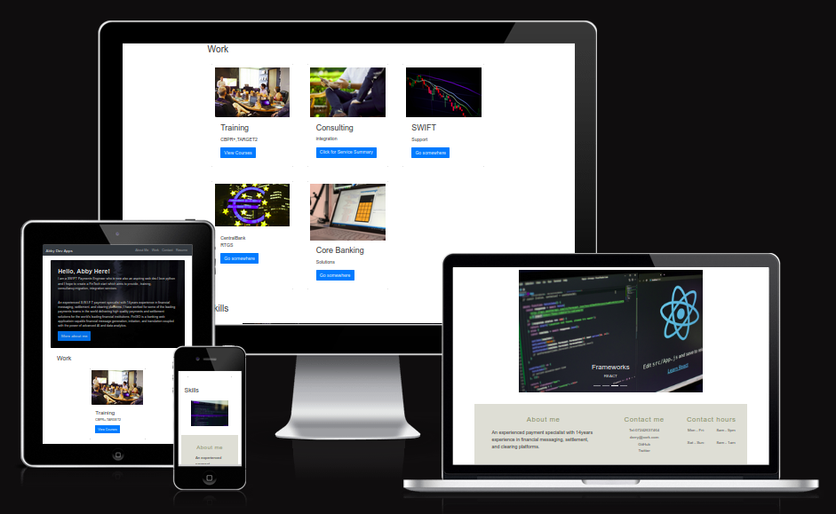

# Abby's Bootstrap Portfolio Page

[Link to the deployed page](https://abbyedxcmk.github.io/Bootstrap-Portfolio/)

[Link to the previous Portfolio deployed page](https://abbyedxcmk.github.io/Abby-Portfolio-Page/)

## Description
This is Module 3 challenge in the Frontend Bootcamp with the title Bootstrap Portfolio. The goal is to implement the frontend CSS framework Bootstrap 4 into the design of the web page.

## Review

You are required to submit ALL THREE of the following for review:

* The URL of the deployed application.

* The URL of the GitHub repository that contains your code. Give the repository a unique name and include a README file that describes the project.

* The URL of your previously deployed portfolio.

---

## Copyright

© 2023 edX Boot Camps LLC. Confidential and Proprietary. All Rights Reserved.
